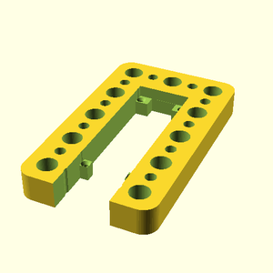
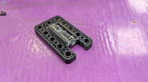
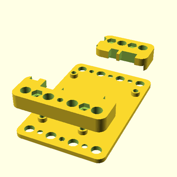
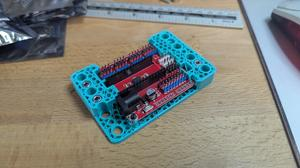
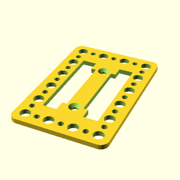
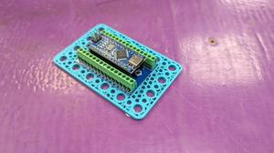
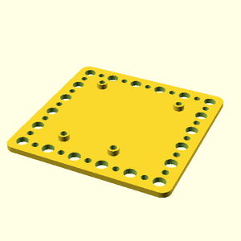
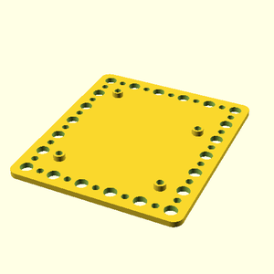
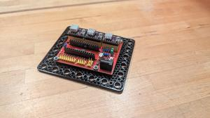

# Oomlout oobb holder electronic breakout board mcu shennie atmega328p arduino compatible

## parts

### oobb_test_base_03_05_09_ex_shennie_atmega328p_arduino_compatible
* link: [/oobb_test_base_03_05_09_ex_shennie_atmega328p_arduino_compatible](oobb_test_base_03_05_09_ex_shennie_atmega328p_arduino_compatible)  
  
 

### oobb_test_base_04_06_03_ex_shennie_atmega328p_arduino_compatible_breakout_arduino_uno_short_footprint_with_clamp
* link: [/oobb_test_base_04_06_03_ex_shennie_atmega328p_arduino_compatible_breakout_arduino_uno_short_footprint_with_clamp](oobb_test_base_04_06_03_ex_shennie_atmega328p_arduino_compatible_breakout_arduino_uno_short_footprint_with_clamp)  
  
 

### oobb_test_base_04_06_03_ex_shennie_atmega328p_arduino_compatible_breakout_screw_terminal_3_5_mm_pitch
* link: [/oobb_test_base_04_06_03_ex_shennie_atmega328p_arduino_compatible_breakout_screw_terminal_3_5_mm_pitch](oobb_test_base_04_06_03_ex_shennie_atmega328p_arduino_compatible_breakout_screw_terminal_3_5_mm_pitch)  
  
 

### oobb_test_base_06_06_03_ex_shennie_atmega328p_arduino_compatible_breakout_arduino_uno_short_footprint
* link: [/oobb_test_base_06_06_03_ex_shennie_atmega328p_arduino_compatible_breakout_arduino_uno_short_footprint](oobb_test_base_06_06_03_ex_shennie_atmega328p_arduino_compatible_breakout_arduino_uno_short_footprint)  
  
 

### oobb_test_base_06_07_03_ex_shennie_atmega328p_arduino_compatible_breakout_cnc_shield
* link: [/oobb_test_base_06_07_03_ex_shennie_atmega328p_arduino_compatible_breakout_cnc_shield](oobb_test_base_06_07_03_ex_shennie_atmega328p_arduino_compatible_breakout_cnc_shield)  
  
 
